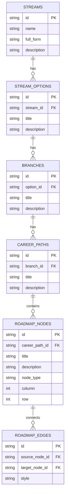

# Career Compass 🧭

> A demo career-guidance web application designed specifically for Indian 12th-grade students to explore higher education streams, degree options, engineering branches, and interactive skill roadmaps.

---

## 🌟 Overview

**Career Compass** simplifies post-12th decision-making for Indian students by providing a structured, 4-tier exploration flow:
1. **Stream Selection**: Explore Class 12 specialization streams (**MPC**, **BiPC**, **CEC**, **MEC**, **Diploma**).
2. **Options Discovery**: Discover degree programs, technical avenues, and career streams.
3. **Branch Specializations**: Narrow down specific academic branches (e.g. CSE, MBBS, BDS, B.Com, BA LL.B, BBA, Mechanical Diploma).
4. **Career Trajectories & Interactive Roadmaps**: View career paths and explore step-by-step topic milestone graphs modeled after *roadmap.sh*.

---

## 🎨 Design System & Aesthetics

Grounding the visual design in authentic **study/stationery materials** rather than generic AI/SaaS neon templates:

- **Charcoal Ink Background**: `#1B1E24`
- **Warm Off-White Typography**: `#E7E4DC`
- **Muted Slate-Blue Primary Accent**: `#4C6580`
- **Warm Brass/Mustard Accent**: `#B98D46` (Used sparingly for calls-to-action & emphasis)
- **Soft Sage State Badges**: `#7C8F72`

### Motion & Interactions
- **Cohesive Easing**: Standardized gentle curve (`ease-out`, 350ms) across all transitions.
- **Scroll-Triggered Reveals**: Staggered `whileInView` row entrances as students scroll down.
- **Mobile-Friendly Click-to-Expand**: Accordion explanation panels expand seamlessly on click/tap.
- **Soft Page Transitions**: Cross-fade and gentle slide transitions between exploration steps.

---

## 🛠️ Technology Stack

- **Framework**: [Next.js 14](https://nextjs.org/) (App Router, Server Components & Client Hooks)
- **Language**: [TypeScript](https://www.typescriptlang.org/)
- **Styling**: [Tailwind CSS](https://tailwindcss.com/)
- **Animation**: [Framer Motion](https://www.framer.com/motion/)
- **Database / ORM**: [PostgreSQL](https://www.postgresql.org/) via [Prisma ORM](https://www.prisma.io/) & [Supabase Client](https://supabase.com/)
- **Icons**: [Lucide React](https://lucide.dev/)

---

## 🗄️ Database Schema & Data Layer

The application schema is fully relational, defined in `prisma/schema.prisma` and `scripts/schema.sql`:



---

## 🚀 Getting Started

### 1. Prerequisites
- Node.js 18+ installed on your system.
- Git.

### 2. Installation & Setup

```bash
# Clone the repository
git clone https://github.com/kesav1478/Carrer-Compass.git
cd Carrer-Compass

# Install dependencies
npm install

# Run development server
npm run dev
```

Open [http://localhost:3000](http://localhost:3000) in your browser to view the application.

---

## 🔌 API Endpoints

- `GET /api/streams` — List all Class 12 streams
- `GET /api/stream-options?stream_id={id}` — Retrieve stream options
- `GET /api/branches?option_id={id}` — Retrieve academic branches
- `GET /api/career-paths?branch_id={id}` — Retrieve career trajectories
- `GET /api/roadmap/[pathId]` — Retrieve graph nodes and edges for visual roadmap

---

## 🗃️ Supabase / PostgreSQL Database Seeding

To run seeds on Supabase or a local PostgreSQL instance:

1. Execute `scripts/schema.sql` in your Supabase SQL Editor.
2. Execute `scripts/seed.sql` to populate streams, options, branches, career paths, and roadmap graphs.

Or using Prisma:

```bash
npx prisma db push
npm run db:seed
```

---

## 🌐 Deployment

### Deploying to Vercel

1. Push your repository to GitHub.
2. Import the project into [Vercel](https://vercel.com).
3. (Optional) Configure `DATABASE_URL` environment variable pointing to your Supabase PostgreSQL database.
4. Deploy!

---

## 📜 License

MIT License. Developed for Indian 12th-grade students career guidance.
